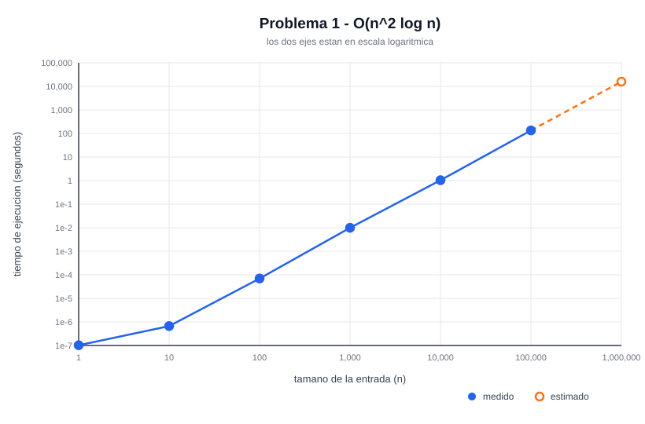
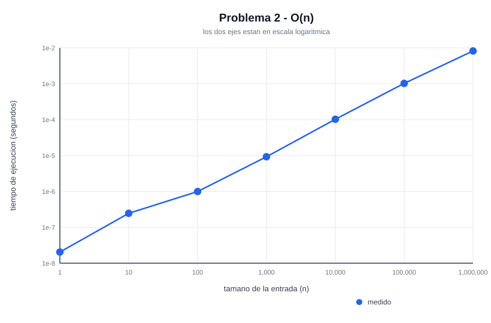
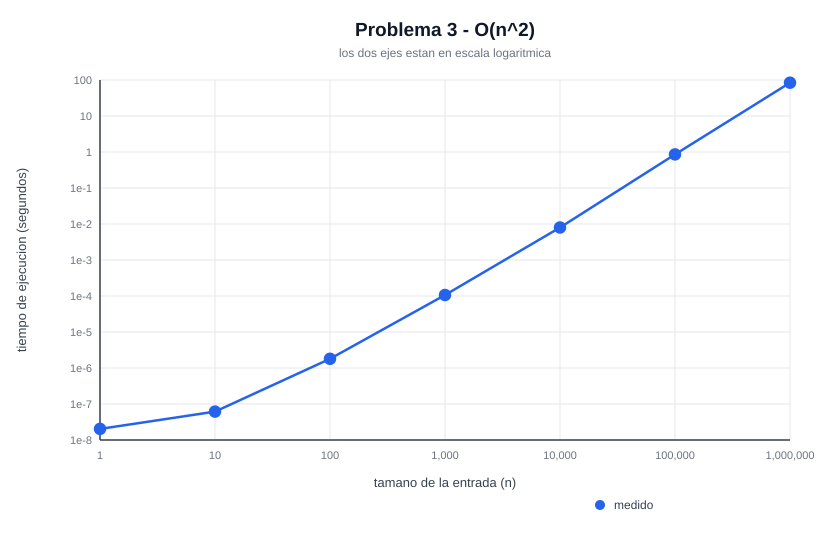

# Laboratorio 8 — Análisis de complejidad

Este laboratorio analiza tres programas, calcula su complejidad en notación Big-Oh y después mide cuánto tardan de verdad en ejecutarse con entradas de distintos tamaños, desde n = 1 hasta n = 1,000,000.

Los programas están implementados en **Elixir**.

## Video

🎥 **Ver la explicación y la ejecución:** _(pendiente de subir)_

## Qué hay en cada archivo

| Archivo / carpeta | Qué es |
| --- | --- |
| `problema1.exs` | El primer programa (tres ciclos anidados) y su medición de tiempo |
| `problema2.exs` | El segundo programa (el que tiene el `break`) y su medición |
| `problema3.exs` | El tercer programa (dos ciclos anidados) y su medición |
| `comun.exs` | Lo que comparten los tres: el cronómetro, la tabla en CSV y el dibujo de la gráfica |
| `correr_todo.exs` | Corre los tres problemas de una sola vez |
| `resultados/` | Las tablas (`.csv`) y las gráficas (`.svg`) que genera el programa |
| `respuestas/` | El PDF con el procedimiento completo del cálculo de complejidad |

La idea de dividirlo así es que cada problema se pueda correr y revisar por separado, y que toda la parte repetida (medir, guardar, graficar) esté en un solo lugar en vez de copiada tres veces.

## Cómo ejecutarlo

Lo único que necesitas instalado es [Elixir](https://elixir-lang.org/install.html). Para comprobar que lo tienes:

```bash
elixir --version
```

### Correr los tres problemas

Desde la carpeta del proyecto:

```bash
elixir correr_todo.exs
```

Imprime las tres tablas en la pantalla y deja los archivos de resultados en la carpeta `resultados/`.

> ⏱️ La corrida completa tarda **unos 4 o 5 minutos**, casi todo en los dos tamaños más grandes.

### Correr solo uno

```bash
elixir problema1.exs
elixir problema2.exs
elixir problema3.exs
```

### Modo rápido

Si solo quieres ver que funciona sin esperar, agrega la palabra `rapido` y mide únicamente hasta n = 10,000 (tarda unos pocos segundos). Los dos tamaños más grandes salen calculados en vez de medidos:

```bash
elixir correr_todo.exs rapido
```

## Qué genera

Por cada problema se crean dos archivos dentro de `resultados/`:

- **`problemaN.csv`** — la tabla de tamaño de entrada contra tiempo, que se puede abrir en Excel.
- **`problemaN.svg`** — la gráfica de tamaño de entrada contra tiempo. Se abre con cualquier navegador.

Las gráficas tienen los dos ejes en escala logarítmica, porque los tiempos van desde millonésimas de segundo hasta minutos y en una escala normal todos los puntos chicos quedarían pegados al cero.

## Resultados

Estos son los datos que salieron al correrlo. La columna **iteraciones** es cuántas vueltas dio el ciclo más interno, y sirve para comprobar que el análisis de complejidad está bien.

### Problema 1 — O(n² log n)

| n | Iteraciones | Tiempo (segundos) | |
| ---: | ---: | ---: | --- |
| 1 | 2 | 0.000000102 | |
| 10 | 120 | 0.000000666 | |
| 100 | 17,850 | 0.000069929 | |
| 1,000 | 2,505,000 | 0.009928700 | |
| 10,000 | 350,070,000 | 1.042700 | |
| 100,000 | 42,500,850,000 | 135.077800 | |
| 1,000,000 | 5,000,010,000,000 | 15,891.218100 | _estimado_ |



Cada vez que n se multiplica por 10, el tiempo se multiplica por unas 100 a 130 veces. Es el crecimiento más rápido de los tres.

### Problema 2 — O(n)

| n | Iteraciones | Tiempo (segundos) |
| ---: | ---: | ---: |
| 1 | 0 | 0.000000020 |
| 10 | 10 | 0.000000246 |
| 100 | 100 | 0.000000993 |
| 1,000 | 1,000 | 0.000009210 |
| 10,000 | 10,000 | 0.000102333 |
| 100,000 | 100,000 | 0.001024000 |
| 1,000,000 | 1,000,000 | 0.008192000 |



Aquí multiplicar n por 10 multiplica el tiempo por 10. Con un millón todavía tarda menos de una centésima de segundo, aunque el código tenga dos ciclos anidados: el `break` lo vuelve lineal.

### Problema 3 — O(n²)

| n | Iteraciones | Tiempo (segundos) |
| ---: | ---: | ---: |
| 1 | 0 | 0.000000020 |
| 10 | 9 | 0.000000061 |
| 100 | 825 | 0.000001802 |
| 1,000 | 83,250 | 0.000106490 |
| 10,000 | 8,332,500 | 0.007987000 |
| 100,000 | 833,325,000 | 0.857292000 |
| 1,000,000 | 83,333,250,000 | 84.041700 |



Multiplicar n por 10 multiplica el tiempo por casi exactamente 100, que es justo lo que se espera de algo cuadrático.

### Comparación

| Problema | Complejidad | Tiempo con n = 1,000,000 |
| --- | --- | --- |
| 2 | O(n) | 0.008 segundos |
| 3 | O(n²) | 84 segundos |
| 1 | O(n² log n) | unas 4 horas y media (estimado) |

## Dos aclaraciones sobre cómo se midió

**El `printf` se cambió por un contador.** En los problemas 2 y 3 lo que iba adentro del ciclo era un `printf("Sequence\n")`. Imprimir en pantalla es muchísimo más lento que el ciclo en sí, así que el tiempo medido terminaría midiendo la velocidad de la terminal y no la del algoritmo; y en el problema 3 con n = 1,000,000 serían más de 83 mil millones de impresiones. En vez de imprimir, el programa cuenta las vueltas: son exactamente las mismas, y de paso el conteo sirve para comprobar que la fórmula del análisis está bien.

**Un punto de la tabla del problema 1 está estimado.** Con n = 1,000,000 ese programa haría más de 5 billones de iteraciones, que en la máquina donde se hizo el laboratorio serían unas 4 horas y media. Ese único punto se calcula multiplicando el número exacto de iteraciones por el costo por iteración que sí se midió en n = 100,000. En la tabla aparece marcado como `estimado`, y en la gráfica va con línea punteada y marcador hueco. Todos los demás puntos de los tres problemas son mediciones reales.
